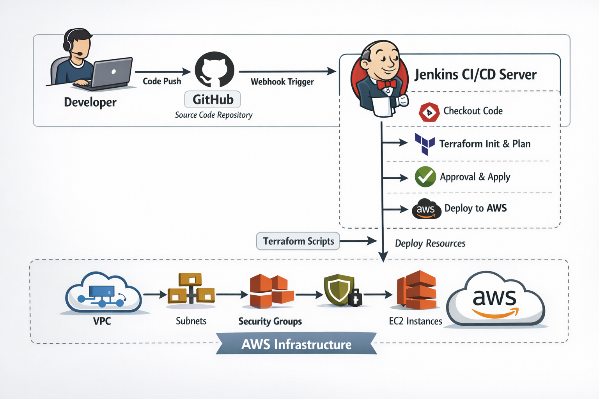

# Terraform AWS Basic Infrastructure with Jenkins CI/CD

## Project Overview

This project demonstrates **Infrastructure as Code (IaC)** using **Terraform** to provision AWS infrastructure, integrated with a **Jenkins CI/CD pipeline** for automated deployment.

The pipeline automatically pulls Terraform code from GitHub, validates it, generates an execution plan, and deploys infrastructure to AWS after manual approval.

This project is designed to showcase **DevOps best practices** such as:

* Infrastructure as Code (Terraform)
* CI/CD Automation (Jenkins)
* Cloud Infrastructure (AWS)
* Secure authentication using **EC2 IAM Role**
* Automated infrastructure provisioning

---

# Architecture Diagram



---

# Architecture Components

## Developer

* Writes Terraform code
* Pushes changes to GitHub repository

## GitHub

* Stores Terraform infrastructure code
* Triggers Jenkins pipeline

## Jenkins CI/CD Server

Runs Terraform pipeline stages:

1. Checkout Code
2. Terraform Init
3. Terraform Format Check
4. Terraform Validate
5. Terraform Plan
6. Manual Approval
7. Terraform Apply

Jenkins runs on an **AWS EC2 instance** and authenticates to AWS using an **IAM role**.

## AWS Infrastructure

Terraform provisions the following resources:

* VPC
* Public Subnet
* Internet Gateway
* Route Table
* Security Group
* EC2 Instance
* Nginx Web Server (installed using EC2 user_data)

---

# CI/CD Pipeline Flow

Developer pushes code to GitHub.

```
Developer
   ↓
GitHub Repository
   ↓
Jenkins Pipeline Trigger
   ↓
Terraform Init
   ↓
Terraform Validate
   ↓
Terraform Plan
   ↓
Manual Approval
   ↓
Terraform Apply
   ↓
AWS Infrastructure Created
```

---

# Project Structure

```
terraform-aws-basic-infra-jenkins
│
├── terraform/
│   ├── versions.tf
│   ├── provider.tf
│   ├── variables.tf
│   ├── main.tf
│   ├── outputs.tf
│   ├── terraform.tfvars
│
├── scripts/
│   └── install_nginx.sh
│
├── jenkins/
│   └── Jenkinsfile
│
├── architecture/
│   └── project1-architecture.png
│
└── README.md
```

---

# Jenkins Pipeline Stages

## 1 Checkout Code

Jenkins pulls Terraform code from GitHub.

## 2 Terraform Init

Initializes Terraform working directory and downloads providers.

```
terraform init
```

## 3 Terraform Format Check

Ensures Terraform code follows standard formatting.

```
terraform fmt -check
```

## 4 Terraform Validate

Validates Terraform configuration syntax.

```
terraform validate
```

## 5 Terraform Plan

Shows infrastructure changes before deployment.

```
terraform plan
```

## 6 Manual Approval

A manual approval step ensures safe deployment.

## 7 Terraform Apply

Creates infrastructure on AWS.

```
terraform apply
```

---

# AWS Infrastructure Created

Terraform provisions:

### VPC

```
10.0.0.0/16
```

### Public Subnet

```
10.0.1.0/24
```

### Internet Gateway

Provides internet access to the VPC.

### Route Table

Routes outbound traffic to the internet gateway.

### Security Group

Allows:

```
SSH - Port 22
HTTP - Port 80
```

### EC2 Instance

* Runs ubuntu 
* Nginx installed using user_data script

---

# Terraform Concepts Used

This project demonstrates the following Terraform concepts:

| Concept             | Description                    |
| ------------------- | ------------------------------ |
| Provider            | AWS provider configuration     |
| Resources           | Infrastructure components      |
| Variables           | Parameterized configuration    |
| Outputs             | Export useful values           |
| Resource references | Dependency graph               |
| user_data           | Instance bootstrap             |
| Terraform workflow  | init → validate → plan → apply |

---

# Security Best Practice

Jenkins authenticates with AWS using an **IAM Role attached to the EC2 instance** instead of storing AWS access keys.

Benefits:

* No credential leakage
* Automatic credential rotation
* AWS best practice for EC2 workloads

---

# How to Run the Project

## 1 Clone Repository

```
git clone https://github.com/<your-username>/terraform-aws-basic-infra-jenkins.git
```

## 2 Navigate to Terraform Directory

```
cd terraform
```

## 3 Initialize Terraform

```
terraform init
```

## 4 Validate Configuration

```
terraform validate
```

## 5 Generate Execution Plan

```
terraform plan
```

## 6 Deploy Infrastructure

```
terraform apply
```

---

# Jenkins Pipeline Setup

Create a Jenkins Pipeline Job:

```
Job Type: Pipeline
Source: Git
Repository: terraform-aws-basic-infra-jenkins
Branch: main
Script Path: jenkins/Jenkinsfile
```

Run the pipeline to deploy infrastructure automatically.

---

# Outputs

After deployment Terraform outputs:

```
instance_public_ip
instance_public_dns
vpc_id
public_subnet_id
```

You can access the web server via:

```
http://<EC2_PUBLIC_IP>
```

---

# Future Improvements

Planned enhancements for future projects:

* Remote Terraform State (S3 + DynamoDB)
* Terraform Modules
* Multi-environment infrastructure
* AWS Load Balancer
* Auto Scaling Groups
* Monitoring with CloudWatch

---

# Author

## Sumanth Parashuram
### Devops Engineer

